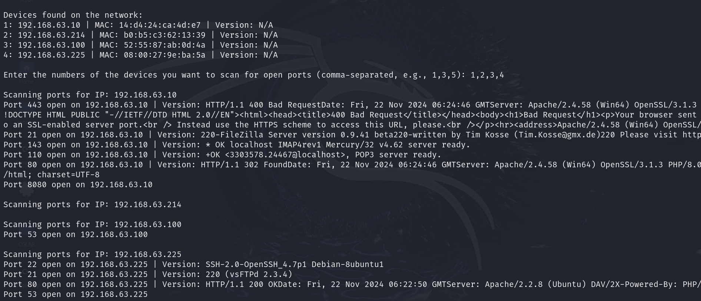
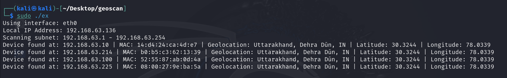
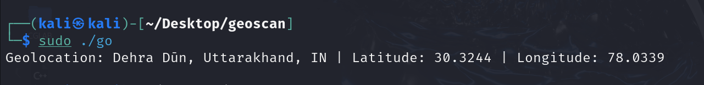

# GeoScan: Network Scanning & Information Gathering Tool

## Overview
**GeoScan** is a network scanning tool built in **C++**, designed to detect and gather comprehensive information about wireless-connected devices on a network. The tool provides details such as **device IP**, **device type**, **open ports**, **version checks**, **mac address** and **geolocation** of devices.

This project is intended for use in enterprise-level network management, cybersecurity monitoring, and emergency response planning.

---

## Features
- **Device Detection**: Identify wireless-connected devices on the network.
- **Open Port Scanning**: Scan common ports (e.g., 21, 80, 443) to identify potential vulnerabilities.
- **Geolocation Mapping**: Display the geolocation of devices based on IP addresses.
- **Version Check**: Perform version checks for identified devices for network security analysis.

---

## Screenshots

### 1. Main Interface

*Description*: The main interface of GeoScan showing connected devices, IP addresses, and device types.

### 2. Geolocation with Latitude and Longitude

*Description*: Geolocation and latitude and longitude of all the devices found on network.

### 3. Geolocation per device

*Description*: Visual representation of device locations using geolocation. Devices are mapped based on their IP addresses.


---

## Technologies Used
- **C++**: Core language used for building the tool, without relying on external libraries like Nmap.
- **Kali Linux**: Platform used for testing and deployment of the tool.
- **Bash Scripting**: Used for automating scanning tasks.

---

## How to Run

1. Clone the repository:
    ```bash
   git clone https://github.com/VedanshPundir/Minor1.git
    ```

2. Navigate to the project directory:
    ```bash
    cd Minor1
    ```

3. Compile the project:
    ```bash
    g++ geo.cpp -o geoscan -lGL -lGLU -lglut
    ```

4. Run the tool:
    ```bash
    ./geoscan
    ```

---

## Future Enhancements
- Support for more ports and protocols.
- Integration with more advanced 3D visualization libraries.
- Extended device information with more network protocols (e.g., SNMP).
- Exporting scan results in multiple formats (CSV, JSON, XML).

---


